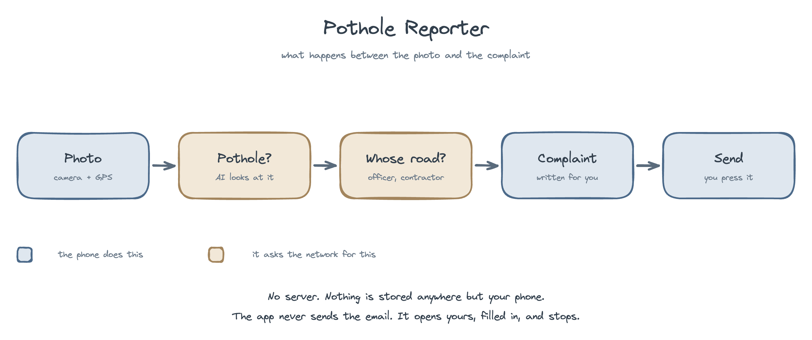
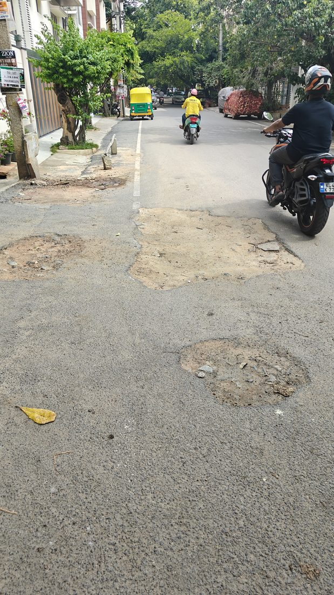

# Pothole Reporter

Around 2,000 people a year die on Indian roads because of potholes, and many more
lose hours to them. Most of those potholes are already someone's job to fix, often
under a contract still in warranty. The gap is that nobody reports them to the right
person with enough detail to act on.

This app closes that gap. Mount your phone, drive, and it finds the potholes,
works out which officer is responsible, finds the road contract they were built
under, and writes the complaint. You read it and press send.

The aim is to get roads repaired, so that fewer people are hurt and fewer hours are
lost sitting in traffic that a good road surface would not have created. It is not
written against anyone. Officers and contractors have a difficult job and a large
city to keep up with; a complaint that arrives with a photograph, exact coordinates,
the right office and the relevant contract is simply easier to act on than one that
does not. That is the whole idea.

No server, no backend, no credentials in the APK. Everything runs on the phone.



## A real one it caught

Not an illustration. This photo, this output, from the app on a phone.



| | |
|---|---|
| Verdict | **medium pothole**, confidence 0.78 |
| Address | 17th Main Road, Sector 3, HSR Layout, Bengaluru, 560102 |
| Routed to | Commissioner, Bengaluru South City Corporation |
| Probable contract | `BBMP/2024-25/RD/WORK_INDENT3877`, SANGAMESH INFRASTRUCTURE |

And the complaint it drafted:

```text
Dear Commissioner, Bengaluru South City Corporation (BSCC),

I would like to report a pothole that needs repair.

Location: 17th Main Road, Sector 3, HSR Layout, Bengaluru, 560102
Coordinates: 12.911500, 77.642700
Map link: https://maps.google.com/?q=12.911500,77.642700
Approximate size: medium

PFA image. This pothole poses a danger to two wheeler riders and other road users. I request the city corporation to inspect and repair it at the earliest, and to route it to the contractor responsible if this road section is still under a maintenance warranty.

Public procurement records indicate this road stretch probably falls under tender BBMP/2024-25/RD/WORK_INDENT3877 ("Pothole Filling Works under Maintenance Works in Ward No. 221-HSR Layout for the year 2024-25 in Bommanahalli Division."), published on 13-09-2024, with SHARANAPPA SANGAMESH( SANGAMESH INFRASTRUCTURE INDIA PRIVATE LIMITED ) recorded as the winning bidder, and it may still be within the maintenance period.

If the defect liability or maintenance period is in force, I request that the repair be carried out by the contractor at no additional cost to the corporation. This is a probable record match; kindly verify against the tender documents.

Thank you for your service to the city.

Regards,
Gaurav Sen
```

That last paragraph is the point. A pothole on a road still under warranty should be
repaired by the contractor at no further cost to the public.

## Install

Download `PotholeReporter.apk` from the
[Releases page](https://github.com/coding-parrot/pothole-reporter/releases), sideload
it, paste an OpenAI API key on first launch, allow camera and location. Two minutes.
English and Kannada, switchable in Settings.

## What it does

**Drive Mode.** Mount the phone facing the road. It captures every 8 metres, checks
up to four frames at once with `gpt-5-mini`, and records the whole drive to video so
nothing between frames is lost. Afterwards you can re-analyse that footage more
densely, or against a better model later; a confirmed pothole keeps its photo and the
video is deleted unless you asked to keep it.

**Single shot.** Point, shoot, get a draft with the photo, address, coordinates, map
link, the responsible officer and the probable contract.

**Review, then send.** Every complaint is a draft you edit. The app never sends
anything; it opens your email app with the full-resolution photo attached and stops.

**Your contribution.** A dashboard totalling potholes found, complaints sent,
kilometres covered, and a map of every one you have reported.

## Who receives them

The app asks Karnataka's state GIS which local body contains the pothole, then
addresses that body's head: a Commissioner for a city corporation, a Chief Officer
for a municipal council or town panchayat. All 18 corporations are covered, including
the five Greater Bengaluru Authority ones that replaced BBMP in 2025, along with 164
councils and panchayats: 182 of the state's 319 bodies.

Where the GIS finds no town, the road belongs to the state PWD or a panchayat and the
app says which panchayat rather than guessing an office. Outside Karnataka, and for
any body whose official address is not yet in the directory, it refuses to name a
recipient. A complaint to the wrong office is worse than no complaint.

Email is a contact channel, not a tracked one. For a ticket number, also file on
Sahaaya 2.0.

## Contracts

Every data source is documented, with commands to verify each one, in
[docs/SOURCES.md](docs/SOURCES.md).

The APK bundles 42,283 awarded road-work contracts pulled from KPPP, Karnataka's
procurement portal, covering the whole state. When a match clears a confidence gate the
complaint names the tender, always as a probable match for the officer to verify.

The portal's search results do not carry the winning bidder, so only the 1,124 contracts
from the Bengaluru snapshot name a contractor; elsewhere the complaint names the tender
and says plainly that no bidder is recorded rather than inventing one. Award records
carry no defect liability period either, so warranty status is inferred from the
publication date and stated as a possibility, never a fact.

Refresh: `python3 tools/pull-kppp.py`. When a match clears a confidence gate, the complaint names the
tender and the contractor, always as a probable match for the officer to verify.
Award records carry no defect liability period, so warranty status is inferred from
the publication date and is stated as a possibility, never a fact.


## Cost

Every frame checked is an API call on your key. A city drive costs rupees. A long
one costs more, because there is no cheap pre-filter: one was tried and it rejected
most real potholes, so it was removed.

## Where this is going

- **Every major Indian city.** Karnataka works today. Mumbai, Delhi, Hyderabad,
  Chennai and Pune each need their own officer directory and tender source, and Delhi
  needs road-ownership data that splits by carriageway width. The remaining 137
  Karnataka bodies need addresses their district sites do not publish.
- **A background camera app.** Capture should not require the app in the foreground
  with the screen awake. That needs a native camera service, which is real work but
  is what makes this usable on an ordinary commute.
- **No API key.** A hosted service so anyone can report a pothole without opening a
  billing account, with the operator's key behind attestation, per-device quotas and
  a spend ceiling. Built, on the `server-backed` branch, not yet live.

## Development

`static/index.html` is the UI and `static/standalone.js` is the whole engine. Copy
both into `android-app/www/`, then `npx cap sync android` and `./gradlew
assembleDebug`. To test in a browser, serve `android-app/www/` and open
`http://localhost:8765/?key=sk-...` in Chromium with `--disable-web-security`.

`eval/` holds the detection benchmark and, more usefully, a log of the accuracy
changes that were tried and rejected, with the evidence.

## Disclaimer

Contract matches are probabilistic and always worded as a probable match to verify;
keep that wording. The app never sends email. Every complaint is sent by you, from
your account, and you are responsible for its contents. Not legal advice, and not
affiliated with GBA, BBMP or any government body.

## Credits

Contract data from the public-domain KPPP snapshot at
[bengaluru-road-contracts.pages.dev](https://bengaluru-road-contracts.pages.dev).
Officer directory from the official GBA site. Geocoding by OpenStreetMap Nominatim,
maps by [Leaflet](https://leafletjs.com). Detection and drafting by OpenAI vision
models.

## License

MIT. See [LICENSE](LICENSE).
